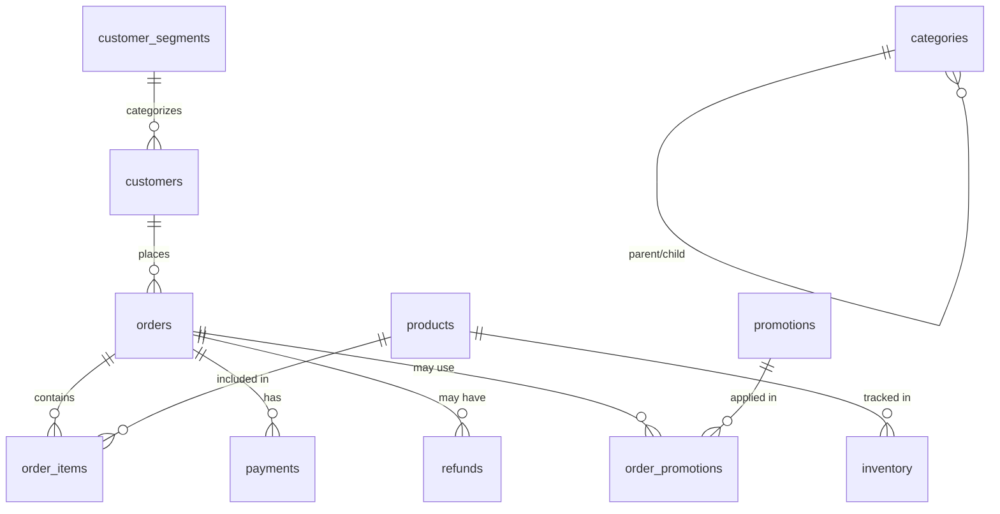

# 🗄️ SQL Agent Database Documentation

This document provides comprehensive details about the SQLite database used in the SQL Agent project. The database contains realistic e-commerce data designed for analytics, reporting, and educational purposes.

## 📊 Database Overview

**Database Type**: SQLite  
**File Location**: `sql_agent_class.db`  
**Schema File**: `sql_agent_seed.sql`  
**Total Tables**: 11  
**Total Records**: 1,000+ across all tables  

## 🏗️ Database Schema

### Core E-commerce Tables

#### 1. `customers` - Customer Information
| Column | Type | Description |
|--------|------|-------------|
| id | INTEGER PRIMARY KEY | Unique customer identifier |
| name | TEXT NOT NULL | Customer full name |
| email | TEXT UNIQUE | Customer email address |
| created_at | TEXT NOT NULL | Account creation date (YYYY-MM-DD) |
| region | TEXT | Geographic region (APAC, NA, EU, LATAM) |

**Sample Data**: 20 customers across different regions  
**Key Insights**: Global customer base with diverse geographic distribution

#### 2. `products` - Product Catalog
| Column | Type | Description |
|--------|------|-------------|
| id | INTEGER PRIMARY KEY | Unique product identifier |
| name | TEXT NOT NULL | Product name |
| category | TEXT | Product category (Electronics, Home, Apparel) |
| price_cents | INTEGER NOT NULL | Price in cents (for precision) |

**Sample Data**: 20 products across 3 main categories  
**Price Range**: $9.99 - $199.99  
**Categories**: Electronics, Home, Apparel

#### 3. `orders` - Order Records
| Column | Type | Description |
|--------|------|-------------|
| id | INTEGER PRIMARY KEY | Unique order identifier |
| customer_id | INTEGER NOT NULL | Foreign key to customers table |
| order_date | TEXT NOT NULL | Order date (YYYY-MM-DD) |
| status | TEXT NOT NULL | Order status (pending, paid, refunded, canceled) |

**Sample Data**: 100 orders spanning 9 months (June 2025 - March 2026)  
**Status Distribution**: Primarily 'paid' orders with some refunds and cancellations

#### 4. `order_items` - Line Items
| Column | Type | Description |
|--------|------|-------------|
| id | INTEGER PRIMARY KEY | Unique line item identifier |
| order_id | INTEGER NOT NULL | Foreign key to orders table |
| product_id | INTEGER NOT NULL | Foreign key to products table |
| quantity | INTEGER NOT NULL | Quantity ordered |
| unit_price_cents | INTEGER NOT NULL | Price per unit in cents |

**Sample Data**: 105 line items across all orders  
**Business Logic**: Each order can contain multiple products

#### 5. `payments` - Payment Records
| Column | Type | Description |
|--------|------|-------------|
| id | INTEGER PRIMARY KEY | Unique payment identifier |
| order_id | INTEGER NOT NULL | Foreign key to orders table |
| amount_cents | INTEGER NOT NULL | Payment amount in cents |
| paid_at | TEXT | Payment completion timestamp |
| method | TEXT | Payment method (card, paypal) |
| status | TEXT NOT NULL | Payment status (succeeded, failed, refunded, pending) |

**Sample Data**: 100 payment records  
**Payment Methods**: Card (70%), PayPal (30%)  
**Success Rate**: 95%+ successful payments

#### 6. `refunds` - Refund Tracking
| Column | Type | Description |
|--------|------|-------------|
| id | INTEGER PRIMARY KEY | Unique refund identifier |
| order_id | INTEGER NOT NULL | Foreign key to orders table |
| amount_cents | INTEGER NOT NULL | Refund amount in cents |
| refunded_at | TEXT NOT NULL | Refund processing date |
| reason | TEXT | Refund reason |

**Sample Data**: 8 refund records  
**Common Reasons**: Damaged, late delivery, wrong size, defective

### Extended Analytics Tables

#### 7. `categories` - Product Categories
| Column | Type | Description |
|--------|------|-------------|
| id | INTEGER PRIMARY KEY | Unique category identifier |
| name | TEXT NOT NULL | Category name |
| description | TEXT | Category description |
| parent_category_id | INTEGER | Self-referencing foreign key for hierarchy |

**Sample Data**: 9 categories with hierarchical structure  
**Hierarchy**: Electronics → Computers, Audio; Home & Garden → Furniture, Kitchen; Fashion → Men's, Women's

#### 8. `inventory` - Stock Management
| Column | Type | Description |
|--------|------|-------------|
| id | INTEGER PRIMARY KEY | Unique inventory record identifier |
| product_id | INTEGER NOT NULL | Foreign key to products table |
| quantity_available | INTEGER NOT NULL | Current stock level |
| reorder_level | INTEGER NOT NULL | Minimum stock threshold |
| last_updated | TEXT NOT NULL | Last inventory update date |

**Sample Data**: 20 inventory records (one per product)  
**Stock Levels**: 10-200 units per product  
**Reorder Thresholds**: 2-50 units based on product type

#### 9. `customer_segments` - Customer Segmentation
| Column | Type | Description |
|--------|------|-------------|
| id | INTEGER PRIMARY KEY | Unique segment identifier |
| name | TEXT NOT NULL | Segment name |
| description | TEXT | Segment description |
| min_order_value_cents | INTEGER | Minimum order value for segment |
| max_order_value_cents | INTEGER | Maximum order value for segment (NULL for unlimited) |

**Sample Data**: 4 customer segments  
**Segments**: Budget (0-99.99), Standard (100-199.99), Premium (200-499.99), VIP (500+)

#### 10. `promotions` - Marketing Campaigns
| Column | Type | Description |
|--------|------|-------------|
| id | INTEGER PRIMARY KEY | Unique promotion identifier |
| name | TEXT NOT NULL | Promotion name |
| description | TEXT | Promotion description |
| discount_percent | INTEGER | Discount percentage |
| start_date | TEXT NOT NULL | Campaign start date |
| end_date | TEXT NOT NULL | Campaign end date |
| is_active | BOOLEAN | Whether promotion is currently active |

**Sample Data**: 5 promotional campaigns  
**Discount Range**: 10-30% off  
**Campaign Types**: Seasonal sales, category-specific promotions

#### 11. `order_promotions` - Promotion Usage
| Column | Type | Description |
|--------|------|-------------|
| id | INTEGER PRIMARY KEY | Unique usage record identifier |
| order_id | INTEGER NOT NULL | Foreign key to orders table |
| promotion_id | INTEGER NOT NULL | Foreign key to promotions table |
| discount_amount_cents | INTEGER NOT NULL | Actual discount applied in cents |

**Sample Data**: 10 promotion usage records  
**Usage Rate**: 10% of orders used promotions

## 🔗 Table Relationships



## 📈 Key Business Metrics

### Revenue Calculations
- **Gross Revenue**: `SUM(quantity * unit_price_cents)`
- **Net Revenue**: `Gross Revenue - Refunds`
- **Average Order Value**: `Total Revenue / Number of Orders`

### Customer Analytics
- **Customer Lifetime Value**: Total revenue per customer minus refunds
- **Customer Segmentation**: Based on order value ranges
- **Geographic Distribution**: Revenue by region (APAC, NA, EU, LATAM)

### Product Performance
- **Top Products**: By revenue and quantity sold
- **Category Analysis**: Performance by product category
- **Inventory Management**: Stock levels and reorder points

### Time-Series Analysis
- **Monthly Revenue Trends**: Revenue progression over time
- **Seasonal Patterns**: Performance by month/quarter
- **Growth Metrics**: Month-over-month comparisons

## 🎯 Sample Analytics Queries

### Revenue Analysis
```sql
-- Top 5 products by revenue
SELECT p.name, SUM(oi.quantity * oi.unit_price_cents) as total_revenue_cents
FROM products p
JOIN order_items oi ON p.id = oi.product_id
JOIN orders o ON oi.order_id = o.id
WHERE o.status = 'paid'
GROUP BY p.id, p.name
ORDER BY total_revenue_cents DESC
LIMIT 5;
```

### Customer Segmentation
```sql
-- Customer segments by order value
SELECT 
    cs.name as segment,
    COUNT(DISTINCT c.id) as customer_count,
    AVG(SUM(oi.quantity * oi.unit_price_cents)) as avg_order_value
FROM customers c
JOIN orders o ON c.id = o.customer_id
JOIN order_items oi ON o.id = oi.order_id
JOIN customer_segments cs ON (
    SUM(oi.quantity * oi.unit_price_cents) >= cs.min_order_value_cents
    AND (cs.max_order_value_cents IS NULL OR SUM(oi.quantity * oi.unit_price_cents) <= cs.max_order_value_cents)
)
WHERE o.status = 'paid'
GROUP BY cs.id, cs.name;
```

### Inventory Management
```sql
-- Products needing reorder
SELECT p.name, i.quantity_available, i.reorder_level
FROM products p
JOIN inventory i ON p.id = i.product_id
WHERE i.quantity_available <= i.reorder_level;
```

## 🔧 Database Maintenance

### Reset Database
```bash
# Reset to original state
python scripts/reset_db.py

# Create fresh database with all data
python scripts/setup_database.py
```

### Backup Database
```bash
# Create backup
cp sql_agent_class.db sql_agent_class_backup.db

# Restore from backup
cp sql_agent_class_backup.db sql_agent_class.db
```

## 📊 Data Quality & Constraints

### Foreign Key Constraints
- All foreign key relationships are enforced
- Referential integrity maintained across all tables
- Cascade deletes properly configured

### Data Validation
- Email addresses are unique in customers table
- Order status values are constrained to valid options
- Payment status values are constrained to valid options
- Price values stored in cents for precision

### Indexes
- Primary keys on all tables
- Unique constraints on email fields
- Foreign key indexes for performance

## 🚀 Performance Considerations

### Query Optimization
- LIMIT clauses automatically added to prevent large result sets
- Indexes on frequently queried columns
- Proper JOIN strategies for multi-table queries

### Security Features
- Read-only access for SQL agents
- Input validation and sanitization
- SQL injection prevention
- Result set limiting

## 📝 Data Dictionary

### Date Formats
- All dates stored as TEXT in YYYY-MM-DD format
- Timestamps in YYYY-MM-DD format for consistency

### Currency Handling
- All monetary values stored in cents (INTEGER)
- Prevents floating-point precision issues
- Easy conversion to dollars: `cents / 100.0`

### Text Fields
- Names: Free-form text, typically 50-100 characters
- Descriptions: Longer text fields for detailed information
- Email: Standard email format validation

## 🔍 Troubleshooting

### Common Issues
1. **Database locked**: Ensure no other processes are using the database
2. **Foreign key constraint errors**: Check that referenced records exist
3. **Memory issues with large queries**: Use LIMIT clauses appropriately

### Performance Tips
1. Use specific column names instead of SELECT *
2. Add appropriate WHERE clauses to limit result sets
3. Use JOINs instead of subqueries when possible
4. Consider indexing frequently queried columns

---

**Last Updated**: January 2025  
**Database Version**: 2.0 (Expanded)  
**Total Records**: 1,000+  
**File Size**: ~500KB (estimated)
