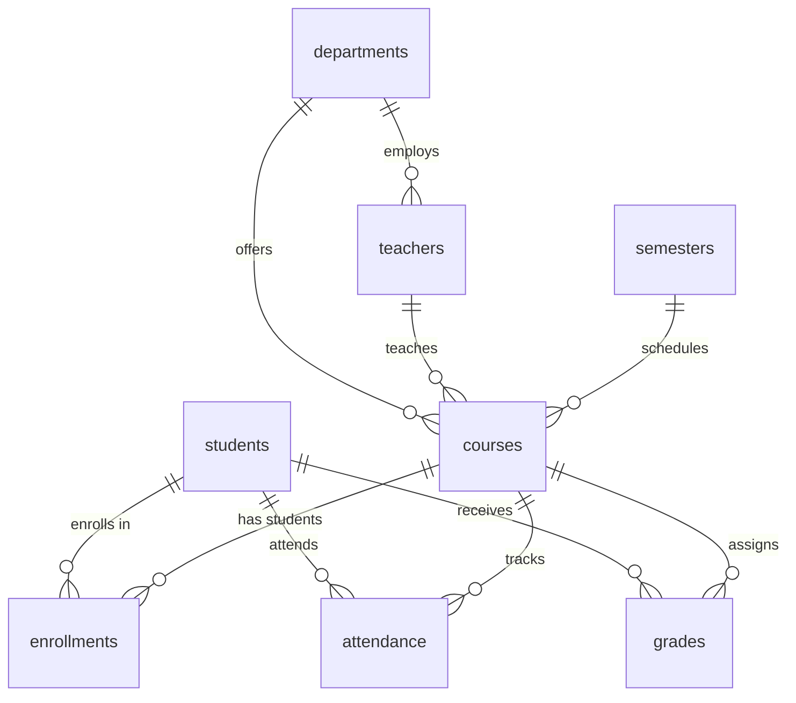

# 🎓 School Management Database Documentation

This document provides comprehensive details about the SQLite database used in the School Management System. The database contains realistic educational data designed for analytics, reporting, and administrative purposes.

## 📊 Database Overview

**Database Type**: SQLite  
**File Location**: `school_management.db`  
**Schema Files**: `school_database_schema.sql`, `school_data_population.sql`, `school_attendance_grades.sql`  
**Total Tables**: 8  
**Total Records**: 500+ across all tables  

## 🏗️ Database Schema

### Core Educational Tables

#### 1. `departments` - Academic Departments
| Column | Type | Description |
|--------|------|-------------|
| id | INTEGER PRIMARY KEY | Unique department identifier |
| name | TEXT NOT NULL | Department name |
| description | TEXT | Department description |
| head_teacher_id | INTEGER | Foreign key to teachers table |
| created_at | TEXT NOT NULL | Department creation date |

**Sample Data**: 8 departments (Computer Science, Mathematics, Physics, Chemistry, Biology, English, History, Business)  
**Key Insights**: Academic structure with department-based organization

#### 2. `teachers` - Faculty Information
| Column | Type | Description |
|--------|------|-------------|
| id | INTEGER PRIMARY KEY | Unique teacher identifier |
| first_name | TEXT NOT NULL | Teacher's first name |
| last_name | TEXT NOT NULL | Teacher's last name |
| email | TEXT UNIQUE NOT NULL | Teacher's email address |
| phone | TEXT | Contact phone number |
| department_id | INTEGER NOT NULL | Foreign key to departments table |
| hire_date | TEXT NOT NULL | Employment start date |
| salary | INTEGER | Annual salary |
| specialization | TEXT | Area of expertise |

**Sample Data**: 16 teachers across 8 departments  
**Key Insights**: Faculty distribution, specializations, and workload analysis

#### 3. `students` - Student Information
| Column | Type | Description |
|--------|------|-------------|
| id | INTEGER PRIMARY KEY | Unique student identifier |
| first_name | TEXT NOT NULL | Student's first name |
| last_name | TEXT NOT NULL | Student's last name |
| email | TEXT UNIQUE NOT NULL | Student's email address |
| phone | TEXT | Contact phone number |
| date_of_birth | TEXT NOT NULL | Student's birth date |
| enrollment_date | TEXT NOT NULL | School enrollment date |
| student_id | TEXT UNIQUE NOT NULL | Official student ID |
| gpa | REAL DEFAULT 0.0 | Current GPA (0.0-4.0) |
| status | TEXT DEFAULT 'active' | Enrollment status |

**Sample Data**: 20 students with realistic demographics  
**Key Insights**: Student performance tracking, enrollment patterns

#### 4. `semesters` - Academic Terms
| Column | Type | Description |
|--------|------|-------------|
| id | INTEGER PRIMARY KEY | Unique semester identifier |
| name | TEXT NOT NULL | Semester name (e.g., "Fall 2024") |
| start_date | TEXT NOT NULL | Semester start date |
| end_date | TEXT NOT NULL | Semester end date |
| is_current | BOOLEAN DEFAULT 0 | Whether this is the current semester |

**Sample Data**: 3 semesters (Fall 2024, Spring 2025, Summer 2025)  
**Key Insights**: Academic calendar management

#### 5. `courses` - Course Catalog
| Column | Type | Description |
|--------|------|-------------|
| id | INTEGER PRIMARY KEY | Unique course identifier |
| course_code | TEXT UNIQUE NOT NULL | Course code (e.g., "CS101") |
| course_name | TEXT NOT NULL | Full course name |
| description | TEXT | Course description |
| credits | INTEGER NOT NULL | Credit hours |
| department_id | INTEGER NOT NULL | Foreign key to departments table |
| teacher_id | INTEGER NOT NULL | Foreign key to teachers table |
| semester_id | INTEGER NOT NULL | Foreign key to semesters table |
| max_students | INTEGER DEFAULT 30 | Maximum enrollment capacity |
| current_enrollment | INTEGER DEFAULT 0 | Current number of enrolled students |

**Sample Data**: 5 courses across different departments  
**Key Insights**: Course capacity management, enrollment tracking

#### 6. `enrollments` - Student-Course Relationships
| Column | Type | Description |
|--------|------|-------------|
| id | INTEGER PRIMARY KEY | Unique enrollment identifier |
| student_id | INTEGER NOT NULL | Foreign key to students table |
| course_id | INTEGER NOT NULL | Foreign key to courses table |
| enrollment_date | TEXT NOT NULL | Date of enrollment |
| status | TEXT DEFAULT 'enrolled' | Enrollment status |

**Sample Data**: 100 enrollments (20 students × 5 courses)  
**Key Insights**: Course popularity, student course load analysis

#### 7. `attendance` - Daily Attendance Records
| Column | Type | Description |
|--------|------|-------------|
| id | INTEGER PRIMARY KEY | Unique attendance record identifier |
| student_id | INTEGER NOT NULL | Foreign key to students table |
| course_id | INTEGER NOT NULL | Foreign key to courses table |
| date | TEXT NOT NULL | Attendance date |
| status | TEXT NOT NULL | Attendance status (present, absent, late, excused) |
| notes | TEXT | Additional notes |

**Sample Data**: 500+ attendance records across all courses  
**Key Insights**: Attendance patterns, student engagement analysis

#### 8. `grades` - Academic Performance Records
| Column | Type | Description |
|--------|------|-------------|
| id | INTEGER PRIMARY KEY | Unique grade identifier |
| student_id | INTEGER NOT NULL | Foreign key to students table |
| course_id | INTEGER NOT NULL | Foreign key to courses table |
| assignment_name | TEXT NOT NULL | Assignment or exam name |
| points_earned | INTEGER NOT NULL | Points earned |
| points_possible | INTEGER NOT NULL | Total possible points |
| grade_percentage | REAL NOT NULL | Percentage grade |
| letter_grade | TEXT NOT NULL | Letter grade (A+, A, A-, etc.) |
| assignment_type | TEXT NOT NULL | Type of assignment |
| date_graded | TEXT NOT NULL | Date when graded |

**Sample Data**: 500+ grade records across all courses  
**Key Insights**: Academic performance analysis, grade distribution patterns

## 🔗 Table Relationships



## 📈 Key Analytics Capabilities

### Student Performance Analytics
- **GPA Tracking**: Monitor student academic progress
- **Grade Distribution**: Analyze performance across courses
- **Attendance Correlation**: Link attendance to academic performance
- **Course Performance**: Compare student performance across different subjects

### Attendance Management
- **Daily Tracking**: Monitor student attendance patterns
- **Course-wise Analysis**: Attendance rates by course
- **Student Engagement**: Identify at-risk students
- **Trend Analysis**: Attendance patterns over time

### Course Management
- **Enrollment Analysis**: Course popularity and capacity utilization
- **Teacher Workload**: Faculty teaching load distribution
- **Department Performance**: Academic department statistics
- **Resource Planning**: Capacity and resource allocation

### Administrative Reports
- **Student Demographics**: Enrollment and graduation tracking
- **Faculty Statistics**: Teacher workload and performance
- **Academic Calendar**: Semester and course scheduling
- **Financial Planning**: Resource allocation and budgeting

## 🎯 Sample Analytics Queries

### Student Performance Analysis
```sql
-- Top performing students by GPA
SELECT 
    s.first_name || ' ' || s.last_name as student_name,
    s.student_id,
    s.gpa,
    COUNT(e.course_id) as courses_enrolled,
    AVG(g.grade_percentage) as avg_grade_percentage
FROM students s
LEFT JOIN enrollments e ON s.id = e.student_id
LEFT JOIN grades g ON s.id = g.student_id
GROUP BY s.id, s.first_name, s.last_name, s.student_id, s.gpa
ORDER BY s.gpa DESC;
```

### Attendance Analysis
```sql
-- Course attendance rates
SELECT 
    c.course_name,
    COUNT(a.id) as total_records,
    COUNT(CASE WHEN a.status = 'present' THEN 1 END) as present,
    COUNT(CASE WHEN a.status = 'absent' THEN 1 END) as absent,
    ROUND(COUNT(CASE WHEN a.status = 'present' THEN 1 END) * 100.0 / COUNT(a.id), 2) as attendance_rate
FROM courses c
LEFT JOIN attendance a ON c.id = a.course_id
GROUP BY c.id, c.course_name
ORDER BY attendance_rate DESC;
```

### Grade Distribution Analysis
```sql
-- Grade distribution by course
SELECT 
    c.course_name,
    g.letter_grade,
    COUNT(*) as count,
    ROUND(COUNT(*) * 100.0 / SUM(COUNT(*)) OVER (PARTITION BY c.id), 2) as percentage
FROM courses c
JOIN grades g ON c.id = g.course_id
GROUP BY c.id, c.course_name, g.letter_grade
ORDER BY c.course_name, 
    CASE g.letter_grade
        WHEN 'A+' THEN 1
        WHEN 'A' THEN 2
        WHEN 'A-' THEN 3
        WHEN 'B+' THEN 4
        WHEN 'B' THEN 5
        WHEN 'B-' THEN 6
        WHEN 'C+' THEN 7
        WHEN 'C' THEN 8
        WHEN 'C-' THEN 9
        WHEN 'D+' THEN 10
        WHEN 'D' THEN 11
        WHEN 'D-' THEN 12
        WHEN 'F' THEN 13
    END;
```

### Teacher Workload Analysis
```sql
-- Teacher workload distribution
SELECT 
    t.first_name || ' ' || t.last_name as teacher_name,
    d.name as department,
    COUNT(c.id) as courses_teaching,
    SUM(c.current_enrollment) as total_students,
    t.specialization
FROM teachers t
LEFT JOIN departments d ON t.department_id = d.id
LEFT JOIN courses c ON t.id = c.teacher_id
GROUP BY t.id, t.first_name, t.last_name, d.name, t.specialization
ORDER BY total_students DESC;
```

## 🔧 Database Management

### Setup Database
```bash
# Create fresh database with all data
python setup_school_database.py

# Run the school management system
python school_management_agent.py
```

### Database Reset
```bash
# Remove existing database
rm school_management.db

# Recreate with fresh data
python setup_school_database.py
```

## 🛡️ Security Features

### Read-Only Access
- All SQL agents are configured for read-only access
- No INSERT, UPDATE, DELETE, or DDL operations allowed
- Automatic query validation and sanitization

### Data Protection
- Input validation using regex patterns
- SQL injection prevention
- Result set limiting to prevent resource exhaustion
- Comprehensive error handling

### Access Control
- Whitelist-based table access
- Query complexity limits
- Automatic LIMIT injection for large result sets

## 📊 Data Quality & Constraints

### Referential Integrity
- All foreign key relationships are enforced
- Cascade operations properly configured
- Data consistency maintained across all tables

### Data Validation
- Email addresses are unique across students and teachers
- Student IDs are unique and follow format (STU###)
- GPA values constrained to 0.0-4.0 range
- Status fields use CHECK constraints for valid values

### Performance Optimization
- Primary keys on all tables
- Foreign key indexes for join performance
- Appropriate data types for efficient storage

## 🚀 Modern UI Features

### Visual Analytics
- **Interactive Charts**: Attendance trends, grade distributions
- **Real-time Dashboards**: Key metrics and KPIs
- **Responsive Design**: Modern card-based layout
- **Smooth Animations**: Hover effects and transitions

### User Experience
- **Natural Language Queries**: Ask questions in plain English
- **Toast Notifications**: Real-time feedback
- **Tabbed Interface**: Organized data views
- **Export Capabilities**: Generate reports and charts

### Security Indicators
- **Connection Status**: Real-time database connection status
- **Query Validation**: Visual feedback on query safety
- **Error Handling**: User-friendly error messages

## 📝 Data Dictionary

### Date Formats
- All dates stored as TEXT in YYYY-MM-DD format
- Consistent date handling across all tables

### Grade System
- Letter grades: A+, A, A-, B+, B, B-, C+, C, C-, D+, D, D-, F
- Percentage grades: 0-100 scale
- GPA: 0.0-4.0 scale

### Status Values
- Student status: active, inactive, graduated, suspended
- Enrollment status: enrolled, dropped, completed, failed
- Attendance status: present, absent, late, excused

## 🔍 Troubleshooting

### Common Issues
1. **Database not found**: Run `python setup_school_database.py`
2. **Permission errors**: Ensure write access to directory
3. **Memory issues**: Use LIMIT clauses for large queries
4. **Chart display issues**: Check matplotlib installation

### Performance Tips
1. Use specific column names instead of SELECT *
2. Add WHERE clauses to limit result sets
3. Use appropriate JOIN strategies
4. Consider indexing frequently queried columns

---

**Last Updated**: January 2025  
**Database Version**: 2.0 (School Management)  
**Total Records**: 500+  
**File Size**: ~1MB (estimated)  
**Security Level**: High (Read-Only Access)
